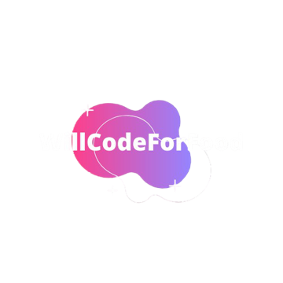

# Lit

*WillCodeForFood* ProCP fire simulation project.

## Info
### Developers

- Chandieka Tasbihyantra
- David Stanislavov
- Jelle Schroijen
- Raymond Hildering
- Siyana Stoyanova
- Vic Verberne

### Project

The main goal of the project is to build a working application that can simulate a fire emergency so that it can determine the most optimal placement of fire extinguishers.

## Demo
